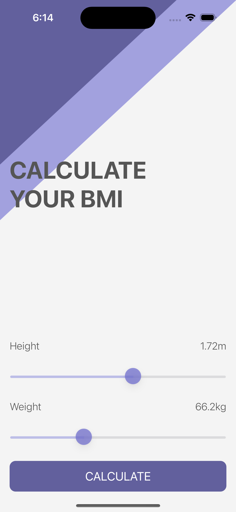
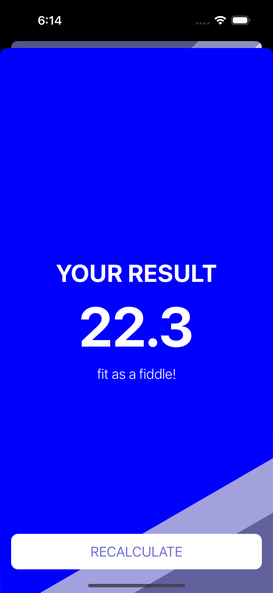

# BMI Calculator

## Description

The BMI (Body Mass Index) Calculator is a simple iOS application developed using Swift. It allows users to calculate their BMI based on their height and weight inputs. The application provides advice and color-coded feedback based on the calculated BMI value.

Solarized Dark             |  Solarized Ocean           | Another Theme
:-------------------------:|:-------------------------:|:-------------------------:
   |   | 

### Features:
- **User-Friendly Interface:** The application features a user-friendly interface with sliders for inputting height and weight.
- **Real-Time Updates:** As users adjust the sliders, the corresponding height and weight values are updated in real-time.
- **BMI Calculation:** Utilizes the BMI formula to calculate the BMI value based on the user's input.
- **Color-Coded Feedback:** Provides color-coded feedback based on the calculated BMI value, helping users understand their BMI status at a glance.
- **Transition to Result Screen:** Upon calculation, users can view the calculated BMI value, along with advice and color-coded feedback, on a separate result screen.
- **Recalculation Option:** Allows users to dismiss the result screen and recalculate their BMI with new height and weight inputs.

## Technologies Used:

- Swift
- UIKit

## How to Use:

1. Clone the repository to your local machine.
2. Open the project in Xcode.
3. Run the application on a simulator or physical iOS device.
4. Input your height and weight using the sliders.
5. Press the "Calculate" button to see your BMI result and related advice.

## Components

### 1. CalculateViewController.swift

Manages the main screen of the application where users input their height and weight to calculate BMI. Handles BMI calculations and transitions to the result screen.

| Element            | Description                                                                                               |
|--------------------|-----------------------------------------------------------------------------------------------------------|
| Calculator Brain   | Manages BMI calculations.                                                                                 |
| UI Elements        | - Height and weight labels: Display the current height and weight values.                                  |
|                    | - Height and weight sliders: Allow users to adjust their height and weight values.                         |
| View Load Action   | Executes actions after the view loads up.                                                                 |
| Slider Change      | Updates the corresponding label when the height or weight slider is moved.                                |
| Calculate Button   | Triggers the BMI calculation and passes height and weight values to the Calculator Brain.                 |
| Segue Preparation  | Prepares for transitioning to the result screen and passes BMI-related data to it.                         |

### 2. CalculatorBrain.swift

Handles all the calculations related to BMI.

| Element          | Description                                                                                               |
|------------------|-----------------------------------------------------------------------------------------------------------|
| BMI Calculation  | Calculates BMI using the provided height and weight values.                                               |
| BMI Properties   | - Value: Stores the calculated BMI value.                                                                |
|                  | - Advice: Provides advice based on the calculated BMI value.                                              |
|                  | - Color: Determines the color representation based on BMI value (for visual feedback).                    |
| Get BMI Value    | Retrieves the calculated BMI value.                                                                      |
| Get Advice       | Retrieves advice based on the calculated BMI value.                                                       |
| Get Color        | Retrieves the color representation based on the calculated BMI value.                                     |

### 3. ResultViewController.swift

Displays the result of the BMI calculation.

| Element           | Description                                                                                               |
|-------------------|-----------------------------------------------------------------------------------------------------------|
| BMI Result Display | Displays the calculated BMI value and related advice.                                                     |
| View Load Action | Executes actions after the view loads up, setting up the displayed BMI value, advice, and background color. |
| Recalculate Button | Dismisses the result view, allowing users to recalculate their BMI.                                        |

### 4. BMI.swift

Defines the structure to hold BMI-related data.

| Element        | Description                                                                                               |
|----------------|-----------------------------------------------------------------------------------------------------------|
| BMI Value      | Stores the calculated BMI value.                                                                         |
| Advice         | Provides advice based on the BMI value (e.g., "underweight," "fit," "overweight").                       |
| Color          | Determines the color representation based on the BMI value (e.g., red, blue, orange).                     |
